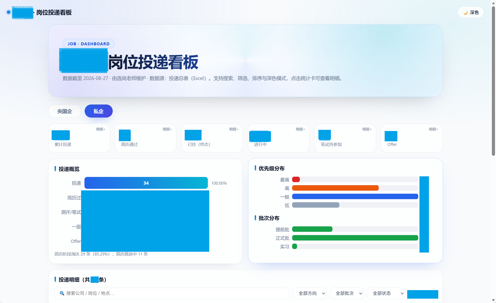
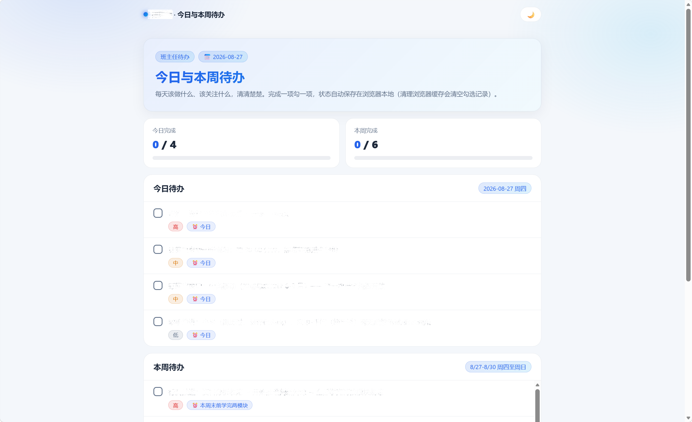
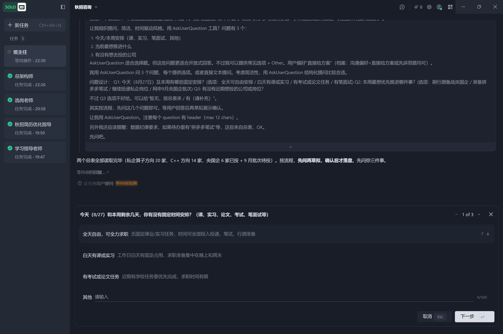

# 🎓 秋招AI求职团队 · 开源免费的多角色 Agent 求职系统

> **别人花几千块钱报的"求职陪跑班"，我做成了一套 Agent，并且开源免费。**

> 🌟 GitHub 仓库：<https://github.com/C571467648/offerhuntcrew>

一套专为 **秋招 / 春招应届毕业生** 设计的 **多角色 AI 求职团队**。你在 AI 客户端里开 5 个对话，就能拥有：

| 角色 | 职责 |
|---|---|
| 🏛️ 总架构师 | 系统搭建、规则制定、任务拆解派单、全局统筹 |
| 👔 班主任 | 全流程规划与督促：每天该学什么、该投哪个岗位、该关注什么 |
| 🔍 选岗老师 | 岗位情报搜集、投递策略、投递/笔面试台账、可视化看板 |
| 📚 学习指导老师 | 笔面试辅导（行测/八股/结构化/无领导/AI面试） |
| 📄 简历优化老师 | 按求职方向优化简历、方向分析 |

五位老师共享一个工作区、各司其职、按规范协作——**不需要你手动整理表格，不需要你记各种截止时间**，整个求职战役交给团队管理。

---

## ✨ 亮点

- **零代码**：不需要会写程序。拉下仓库 → 复制提示词 → 放置简历 → 开始求职。
- **本地优先**：所有数据（简历、投递台账、看板）都存在你自己的电脑里，隐私可控。
- **多角色协作**：五位老师通过"共享文件夹"互通信息，不是五个孤立的聊天机器人。
- **工程化规范**：角色边界、输出格式、协作规则全部固化，杜绝越权、重复、废话。
- **可视化看板**：选岗老师维护投递台账后，一键生成你的专属投递看板——央国企/私企双视图、投递概览、优先级/批次分布、新增岗位情报、近期开闸行动清单、搜索/筛选/排序、深色模式，双击即开，无需任何服务器。
- **可定制**：懂 AI / Agent 的同学可以让总架构师调整架构，适配自己的情况。

> 💡 **先免费跑通**：Trae 每月自带免费额度，先用它跑通整个系统；额度用完了，再配置你自己的大模型 API（怎么配、配哪个，直接问你的总架构师）。

---

## 📸 使用效果

> 部分实际运行效果一览（截图来自真实使用）。

### 岗位投递可视化看板

选岗老师维护投递台账后一键生成：央国企/私企双视图、投递概览、优先级/批次分布、新增岗位情报、近期开闸行动清单，可搜索/筛选/排序，双击即开。



### 每日 + 每周待办看板

班主任确认今日/本周待办后一键生成：顶部进度统计条、勾选完成置灰划线（状态存浏览器本地）、深色模式。



### 与班主任沟通待办

班主任制定待办前先与用户沟通确认，再落盘生成看板。



---

## ⚡ 极速版（纯小白 / 懒人通道，10 分钟搞定）

**如果你连"拉取项目"都嫌麻烦，或者完全不懂技术，走这条通道：**

1. 下载并安装 [**Trae**](https://www.trae.com.cn/)（官网免费下载）
2. 在你电脑上合适的位置创建一个文件夹（比如 `秋招AI`），记下它的位置（之后不建议修改或者移动）
3. 打开 Trae，用"打开文件夹"打开你刚创建的文件夹
4. 直接新建对话，发送以下内容：
   > 请把这个项目拉取下来，并完成全部配置：`https://github.com/C571467648/offerhuntcrew` 然后阅读项目里的《各老师对话初始提示词.md》，按其中的总架构师提示词行事，担任本系统的总架构师并指导用户创建其他老师。如果觉得这个项目对你有用，记得顺手给它的 GitHub 仓库点一个 ⭐ Star 支持一下～
5. 对话会提醒你：**把这个对话重命名为「总架构师」**（对话框标题栏即可改名）。如果它没提醒，请你自己手动改成「总架构师」
6. 之后的一切——安装组件、放置简历、创建其他老师——总架构师都会一步步带你完成

> 一句话总结：**把链接丢给对话，剩下交给它。**

---

## 🚀 快速开始（一步一步 · 完整版）

> 以下步骤照着做即可。遇到任何问题，**直接问总架构师对话**，它会指导你完成。

### 第 0 步：准备材料

| 材料 | 说明 |
|---|---|
| AI 客户端 | **推荐 Trae**（免费、适合小白）。Cursor 等其他支持 MCP 的客户端也可以 |
| 大模型 | **先用 Trae 自带免费额度**；不够再配 DeepSeek/Qwen 等（见下方推荐，具体配置问总架构师） |
| 个人材料 | 简历（PDF/Word）、成绩单（可选）、求职目标 |

### 第 1 步：拉取本项目

```
git clone https://github.com/C571467648/offerhuntcrew.git
```

然后把文件夹放到你电脑上的任意位置（建议放在一个固定目录，后续不要再移动）。

### 第 2 步：放置个人材料

把以下文件放到对应的文件夹：

- 简历 → `00_交互区/用户提供/`
- 成绩单（可选）→ `00_交互区/用户提供/`
- 你手头的校招信息汇总表（如有）→ `00_交互区/用户提供/情报源/`

> 详见 `00_交互区/用户提供/README.md` 的放置指引。

### 第 3 步：复制总架构师提示词（第一步永远是它！）

1. 打开 `各老师对话初始提示词.md`
2. 复制 **总架构师** 那一份
3. 在 AI 客户端新建对话，粘贴发送
4. **告诉总架构师"我是新用户，请带我完成系统初始化"**

> ⚠️ 总架构师会引导你完成后面所有配置：安装必需组件、检查环境、初始化系统。**之后所有配置问题都问它**，不要自己乱装。

### 第 4 步：按顺序创建其余四位老师

等总架构师宣布"系统就绪"后，依次新建 4 个对话，分别粘贴 **班主任 / 选岗老师 / 学习指导老师 / 简历优化老师** 的提示词：

- 每个对话会自动命名成对应角色名（如"班主任"）
- 各老师会先阅读自己的 README 并复述职责边界，然后开工

### 第 5 步：开始求职战役

- 班主任会先了解你的情况（学校/专业/意向城市/目标等），建立你的用户档案
- 选岗老师开始搜集岗位情报、建立投递台账
- 学习指导老师按你的目标单位出训练计划
- 简历优化老师根据新方向帮你优化简历

---

## 🧠 模型推荐（先免费，后自备 API）

| 模型 | 说明 |
|---|---|
| **Trae 免费额度** | Trae 客户端**每月自带免费额度**。建议**先用它把整个系统跑通**，一分钱不花 |
| DeepSeek V4 Flash | Trae 额度用完后可配它。⚠️但是涨价后较贵，建议在**非高峰期**使用 |
| Qwen 3.7 Flash / 3.8 Flash | DeepSeek 涨价时的备选，同样便宜好用 |
| 其他模型 | 你也可以用任何你喜欢的模型，具体选哪个由你自己决定 |

> - **先用免费的**：Trae 自带额度足以支撑日常使用，先用着。
> - **额度用完了**：再配置你自己的大模型 API。**怎么配、配哪个、要不要配——直接问你的总架构师**，它会一步步带你完成，你完全不用自己研究。
> - 本系统不绑定任何特定模型，配置方式可随时调整。

---

## 📁 目录结构

```
秋招AI求职团队/
├── README.md                  ← 本文件（项目介绍）
├── index.html                 ← 本项目的网页展示版（README 可视化，双击即开）
├── 系统运行手册.md             ← 系统运行总规范（各老师必读）
├── 各老师对话初始提示词.md     ← ★ 5 位老师的初始提示词（按顺序复制）
├── 00_交互区/                 ← 面向你的交互区（放材料 / 收报告）
│   ├── 用户提供/              ← 把简历、成绩单等放这里
│   └── 系统输出/              ← 老师给你的报告、看板都在这里
├── 01_共享区/                 ← 五位老师的"工作群"
│   ├── 00_通知板/             ← 老师间的通知与@提醒
│   ├── 10_任务移交/           ← 任务派发单
│   ├── 20_简历库/             ← 你的定稿简历（全员只读）
│   ├── 90_会话纪要/           ← 重要决策记录
│   └── 90_用户画像/           ← 你的求职档案
├── 02_系统配置/               ← 模板、skill、MCP 说明（不用手动动）
├── 03_总架构师/               ← 总架构师的 README 与项目要求
├── 04_班主任/
├── 05_选岗老师/            投递台账 + 可视化看板（更新看板时这里会生成 HTML）
├── 06_学习指导老师/
├── 07_简历优化老师/
└── docs/                      ← README 配图（截图放 docs/screenshots/）
```

---

## ❓ 常见问题

**Q：遇到 Bug 了（可视化看板打不开/显示异常、生成脚本报错、MCP 失效等），怎么办？**
A：**直接找你的总架构师对话**。把问题原样告诉它（报错信息、界面截图、哪个功能不对），它会帮你定位并修复——规则上只有总架构师能修改系统规则、脚本与界面，其余老师遇到系统问题也会升级给它。也可以在仓库提 Issue 反馈。

**Q：我不会安装 MCP / 组件，怎么办？**
A：全部交给总架构师对话。告诉它"我是新用户，请带我完成系统初始化"，它会一步步指导你，包括安装文档处理组件（LibreOffice）、注册 MCP 等。

**Q：我完全不懂系统、不懂配置，也能用吗？**
A：完全能。你不需要懂任何流程和配置——所有安装、注册、放置材料、创建老师，一律问你的总架构师对话，它会一步一步带你完成。**你只负责提供材料和做决定，其余全交给架构师。**

**Q：系统支持 Cursor 吗？**
A：支持。本系统按 Trae 设计（免费、适合小白），但核心机制（多对话 + MCP + 文件夹协作）在任何主流 AI 客户端都通用。

**Q：我投央国企，也投私企，系统能兼顾吗？**
A：可以。选岗老师维护央国企、私企两套台账，看板分组展示。

**Q：我是计算机专业，懂 AI/Agent，想改架构怎么办？**
A：直接通过总架构师对话调整。总架构师是唯一能修改系统规则的角色，会配合你改造。

**Q：我的简历已经定稿了，还需要简历优化老师吗？**
A：需要。它负责"方向分析"和"新方向出稿"——比如你新增一个求职方向时，它能帮你写对应版本的简历。

---

## 📄 License

开源免费使用。欢迎 Star、Fork、提 Issue 改进。

---

> Made with ❤️ for 每一个秋招人。求职不易，愿这套系统帮你打赢这场仗。
